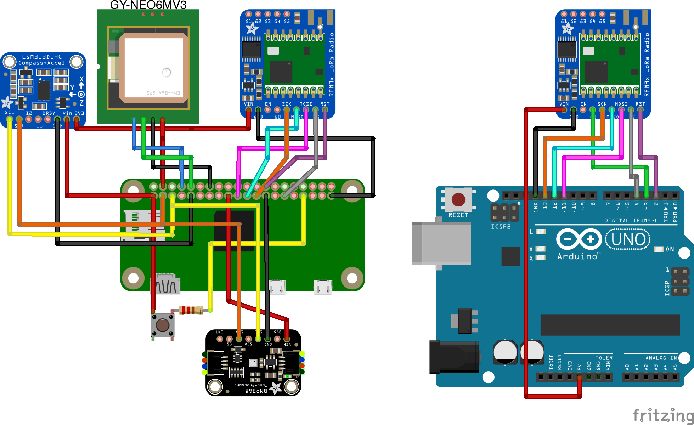

# White Vest:

[](https://github.com/johnjones4/white-vest/actions/workflows/build.yml)


White Vest is a project for collecting, logging, emitting, and visualizing telemetry from a model rocket containing an inboard Raspberry Pi Zero with an Arduino receiving telemetry. To learn more about this project, visit my [blog post](https://johnjonesfour.com/2020/10/03/model-rocket-telemetry-part-1/) documenting it. This project is named after the iconic [white vest that flight director Gene Kranz wore during Apollo 13](https://airandspace.si.edu/stories/editorial/gene-kranz%E2%80%99s-apollo-13-vest). 

## Hardware

This project requires a Raspberry Pi Zero for the inboard systems and an Arduino for ground telemetry reception.

### Inboard 

The inboard system records video and measures pressure, temperature, altitude, acceleration, and orientation. The total payload weight of the module, with 3D printed parts for mounting, weights about 115 grams, but your mileage may vary.

* [Raspberry Pi Zero W](https://www.adafruit.com/product/3400)
* [Lithium Ion Cylindrical Battery - 3.7v 2200mAh](https://www.adafruit.com/product/1781)
* [PowerBoost 500 Basic - 5V USB Boost @ 500mA from 1.8V+](https://www.adafruit.com/product/1903)
* [Adafruit RFM95W LoRa Radio Transceiver Breakout - 868 or 915 MHz - RadioFruit](https://www.adafruit.com/product/3072)
* [Adafruit BMP388 - Precision Barometric Pressure and Altimeter](https://www.adafruit.com/product/3966)
* [Zero Spy Camera for Raspberry Pi Zero](https://www.adafruit.com/product/3508)
* [Triple-axis Accelerometer+Magnetometer (Compass) Board - LSM303](https://www.adafruit.com/product/1120)
* [GPS Module](https://www.amazon.com/gp/product/B084MK8BS2/ref=ppx_yo_dt_b_asin_title_o00_s00?ie=UTF8&psc=1)

### Ground

* [Arduino Uno Rev3](https://store.arduino.cc/usa/arduino-uno-rev3)
* [Adafruit RFM95W LoRa Radio Transceiver Breakout - 868 or 915 MHz - RadioFruit](https://www.adafruit.com/product/3072)

### Wiring



The air hardware is wired to the following Raspberry Pi pins:

* **PowerBoost 500 Basic:**
  * 5v -> Pi 5V
  * Ground -> Pi Ground
* **BMP388 (I2C)**
  * VIN -> Pi 3V
  * GND -> Pi GND
  * SCK -> Pi SCL
  * SDI -> Pi SDA 
* **LSM303 (I2C)**
  * VIN -> Pi 3V
  * GND -> Pi GND
  * SCL -> Pi SCL
  * SDA -> Pi SDA
* **Camera**
  * Pi Camera ribbon connection
* **RFM95W (SPI)**
  * VIN -> Pi 3V
  * GND -> Pi GND
  * SCK -> Pi SPI SCLK
  * MOSI -> Pi SPI MOSI
  * MISO -> Pi SPI MISO
  * CS -> Pi D5
  * RST -> Pi CE1
* **GPS Module (Serial)**
  * VIN -> Pi 5V
  * GND -> Pi GND
  * TX -> Pi RX
  * RX -> Pi TX
* **Momentary, Normally Open Switch**
  * In -> Pi 3V
  * Out -> Resistor -> Pi D16

The ground hardware, much more simply, is wired to the following Arduino pins:

* **RFM95W**
  * VIN -> Arduino 5v
  * GND -> Arduino GND
  * G0 -> Arduino 13
  * MISO -> Arduino 12
  * MOSI -> Arduino 11
  * CS -> Arduino 4
  * RST -> Arduino 2

## Telemetry

The air software logs all sensor readings to a timestamped CSV file under `data` and transmits them using a LoRA transceiver, and data logging cuts off after 30 minutes. The transmitted data is a simple binary sequence of doubles in the following order:

* Unix Timestamp
* Barometric Pressure (Pascals)
* Temperature (Celsius)
* Acceleration X (M/s/s)
* Acceleration Y (M/s/s)
* Acceleration Z (M/s/s)
* Magnetic Direction X (Degrees)
* Magnetic Direction Y (Degrees)
* Magnetic Direction Z (Degrees)
* Latitude
* Longitude
* GPS Signal Quality
* Number of GPS sats

## Setup

### Ground

The ground Arduino software receives transmitted packets and echos them out to serial encoded in base 64. Install the `ground.ino` file using the Arduino IDE.

### Dashboard

The dashboard is a text-based tool for tracking and logging received telemetry. To activate it, download a release from the GitHub project or build the dashboard using the following steps:

```bash
$ cd ~
$ git clone git@github.com:johnjones4/white-vest.git
$ cd white-vest/dashboard
$ make install
$ make build
```

Then, run the dashboard using the following `build/dashboard-Darwin-i386 /dev/cu.usbmodem143101`. Note that `dashboard-Darwin-i386` will change based on the system you are using and `/dev/cu.usbmodem143101` is the path to the Arduino serial connection.

### Air

This software requires [I2C](https://learn.adafruit.com/adafruits-raspberry-pi-lesson-4-gpio-setup/configuring-i2c), [SPI0](https://www.raspberrypi-spy.co.uk/2014/08/enabling-the-spi-interface-on-the-raspberry-pi/), SPI1, and [Serial](https://maker.pro/raspberry-pi/tutorial/how-to-use-a-gps-receiver-with-raspberry-pi-4) to be enabled on a Raspberry Pi. (To enable SPI1, add `dtoverlay=spi1-3cs` to the file `/boot/config.txt`.)

To install this software on a Raspberry Pi, execute the following:

```bash
$ cd ~
$ git clone git@github.com:johnjones4/white-vest.git
$ cd white-vest/air
$ make install
```

Then, run `make install-service`

To start the software in the background, run `sudo systemctl start air`

In addition, you may verify wiring connections by running `make sensor-test`
